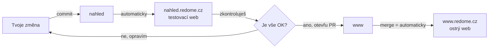

# Jak nasazovat změny

Tenhle návod popisuje, jak dostat změnu z tvého počítače až na ostrý web.
Máme **dvě prostředí**, jejichž větev se vždy jmenuje stejně jako subdoména:

| Prostředí                | Větev    | URL                        | K čemu slouží                                                                                     |
| ------------------------ | -------- | -------------------------- | ------------------------------------------------------------------------------------------------- |
| **Stage** (testovací)    | `nahled` | `https://nahled.redome.cz` | Tady si v klidu vyzkoušíš, že je vše v pořádku. Nikomu nevadí, když tu něco zrovna není dokonalé. |
| **Produkce** (ostrý web) | `www`    | `https://www.redome.cz`    | Tohle vidí zákazníci. Sem pouštíme jen ověřené věci.                                              |

> **Hlavní pravidlo:** Na produkci pouštěj jen to, co sis ověřil na stage. Nikdy nepřeskakuj testovací krok.

---

## Postup krok za krokem

### 1. Udělej změnu a ulož ji (commit)

Uprav, co potřebuješ, a ulož to **commitem do větve `nahled`**.
Ke commitu napiš krátce, co jsi změnil — např. _„Přidán kontaktní formulář"_.

### 2. Počkej, až se změna objeví na stage

Po commitu se změna **sama nahraje na `nahled.redome.cz`**. Nemusíš nic dělat, jen chvíli počkat.

### 3. Zkontroluj to na stage

Otevři `https://nahled.redome.cz` a projdi, jestli změna vypadá a funguje, jak má.
Tohle je tvoje poslední šance něco chytit, než to uvidí zákazníci.

### 4. Otevři PR do produkce

Když jsi spokojený, na GitHubu otevři **Pull Request** z `nahled` do `www`.
PR si představ jako formulář _„chci tohle pustit na ostrý web"_.

### 5. Popiš, co se mění

Do PR napiš krátké shrnutí — **co a proč** se nasazuje.
Slouží to jako záznam: za měsíc budeš vědět, co se kdy pustilo ven.

### 6. Potvrď nasazení (merge)

Klikni na **Merge**. Změna se **sama nahraje na produkci (`www.redome.cz`)**.
Hotovo — je to venku. ✅

---

## Celý tok v jednom obrázku

---

## Slovníček (kdyby ti něco nebylo jasné)

- **Commit** — uložení změny s krátkým popisem, co se změnilo.
- **Větev (branch)** — oddělená „linka" kódu. My máme dvě: `nahled` (stage) a `www` (ostrý web). Jméno větve odpovídá subdoméně, kam se nasazuje.
- **PR (Pull Request)** — žádost o přesunutí změn z jedné větve do druhé. Tady funguje jako brána na produkci.
- **Merge** — potvrzení a sloučení změn. Po mergi do `www` se nasadí na ostrý web.
- **Stage** — testovací web, kde se nic neláme.
- **Produkce** — ostrý web, který vidí zákazníci.

---

## Když se něco pokazí

Nasazené změny na produkci jsou označené značkou (tag), takže se dá vrátit poslední funkční verze.
Pokud si nevíš rady, **nezasahuj do produkce ručně** a ozvi se — vrácení vyřešíme společně.
